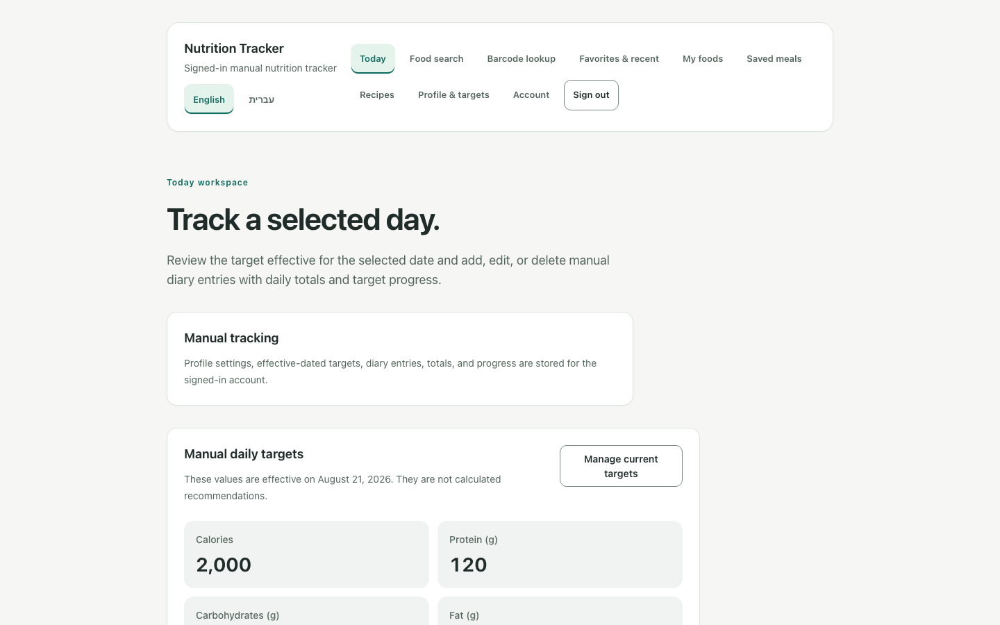
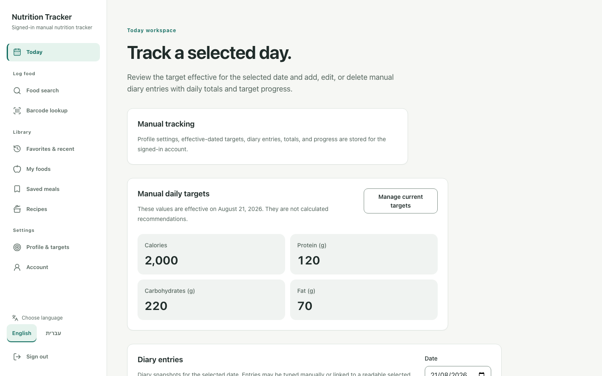
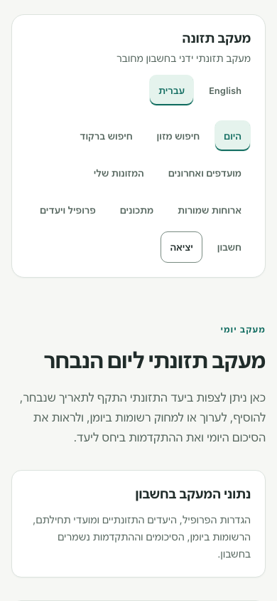
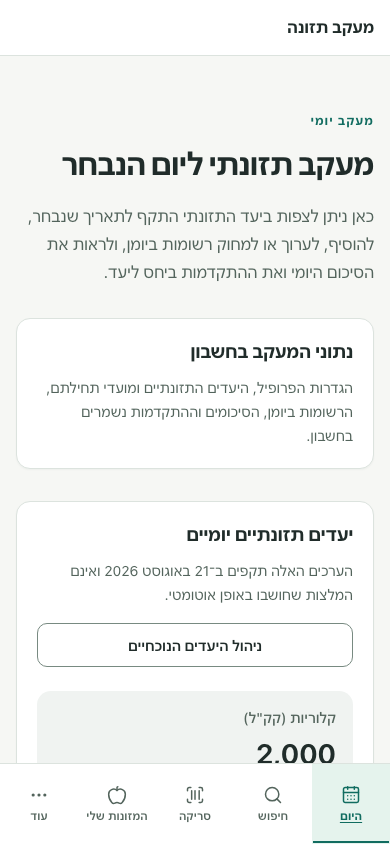
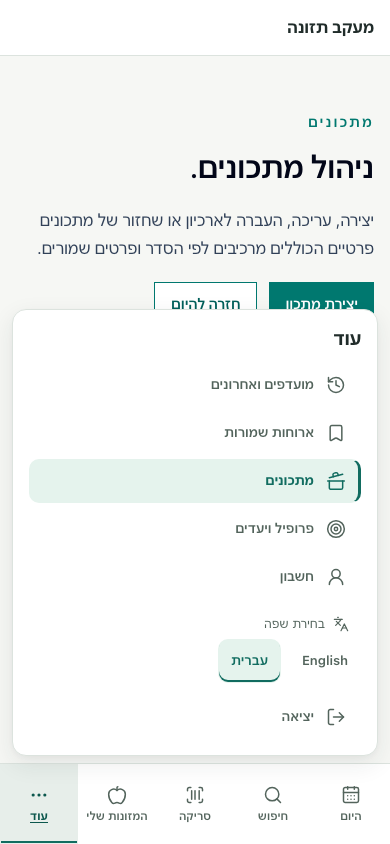

# UI Phase 2 visual evidence

All captures use one synthetic invited and activated account on the local Docker Supabase stack. No production access or deployment was used. After captures and supplemental review, both screenshot app servers and the six task-started local Supabase containers were stopped; their configuration and the existing database volume were preserved without a reset. The before build is an exact archive of `2b38129173b4e2352bddacf7bf2c7df52d23437a`; the after build is the isolated implementation worktree.

The fixed diary date is `2026-08-21`. The same profile has targets of 2,000 kcal, 120 g protein, 220 g carbohydrates and 70 g fat, and an empty diary. Captures use Chromium from the pinned Playwright runtime, device scale factor 1, reduced motion, and explicit top-of-page framing. No credentials or authenticated storage state are included.

The baseline has no More surface. Its More comparison captures show the equivalent fully visible wrapping navigation on Recipes; the after captures show the native More surface open on the same route.

| View | Before | After |
| --- | --- | --- |
| Desktop 1440×900, Today English | [Before](before-desktop1440-today-en.png) | [After](after-desktop1440-today-en.png) |
| Desktop 1440×900, Today Hebrew | [Before](before-desktop1440-today-he.png) | [After](after-desktop1440-today-he.png) |
| Desktop 1440×900, Recipes English | [Before](before-desktop1440-recipes-en.png) | [After](after-desktop1440-recipes-en.png) |
| Mobile 390×844, Today English | [Before](before-mobile390-today-en.png) | [After](after-mobile390-today-en.png) |
| Mobile 390×844, Today Hebrew | [Before](before-mobile390-today-he.png) | [After](after-mobile390-today-he.png) |
| Mobile 390×844, More English | [Before](before-mobile390-more-en.png) | [After](after-mobile390-more-en.png) |
| Mobile 390×844, More Hebrew | [Before](before-mobile390-more-he.png) | [After](after-mobile390-more-he.png) |
| Mobile 320×720, Today Hebrew | [Before](before-mobile320-today-he.png) | [After](after-mobile320-today-he.png) |

Additional implementation captures: [768×900 Hebrew](after-tablet768-today-he.png), [1024×900 English](after-desktop1024-today-en.png), [1280×900 Hebrew](after-desktop1280-today-he.png).

[Before manifest](before-manifest.json) and [after manifest](after-manifest.json) record screenshot SHA-256, routes, locale, direction, viewport dimensions and observed document widths. All 19 captures have zero horizontal overflow.

## Desktop comparison

## Mobile comparison

## Supplemental browser review

[Supplemental review results](supplemental-review.json) record 10 passing checks using the same local account:

- WebKit and Firefox, English/Hebrew, JavaScript enabled/disabled at 320×720: native More opens with Enter, all five secondary destinations and language/sign-out actions are visible, selected Recipes retains `aria-current`, More has an active indication without `aria-current`, targets measure at least 44×44 px, the panel fits above the bar, and there is no horizontal overflow. JavaScript-enabled Escape restores focus; no-JS Enter closes natively.
- Chromium, English/Hebrew at 390×844: actual compiled CSS replayed with synthetic asymmetric safe-area values (top 47 px, bottom 34 px, left 28 px, right 0 px) retains physical left/right bottom-bar padding, content/header inset protection, panel bounds, and zero overflow. This supplements engine validation and does not claim physical-device testing.

Landmark visibility metadata explicitly excludes panel descendants of closed native `details`; their retained layout geometry alone does not imply visibility.

[Production advisory comparison](production-advisory-comparison.json) records identical before/after findings and verifies that Lucide is the only new package entry; existing package versions are unchanged. The dependency gate remains blocked by baseline findings.

## Post-security refresh context — 2026-10-10

The preceding dependency-gate failure and advisory comparison belong to original reviewed head `fb38c40dc680fb8647621686f4400147c868cb4d`. They are preserved historical measurements. Security PR #177 subsequently merged as `bb4ee3fec0b431966d9e1fdca19383fc5f5859f5`; the refreshed graph retains Next 16.3.8, sharp 0.35.5, source-map-js 1.2.2 and Lucide 1.54.0, with a fresh production audit/gate of **0/0/0/0**.

[Post-security reconciliation](post-security-reconciliation.json) distinguishes the new dependency and local validation results. All reviewed UI/test blobs, 19 PNGs, original screenshot hashes/geometry, both manifests, supplemental review results and the original advisory JSON are unchanged. The original screenshots remain representative; fresh navigation and Phase 11D tests validate the combined runtime without overwriting historical captures. The [implementation report](../../ui-phase-2-responsive-navigation.md#post-security-remediation-reconciliation--2026-10-10) and current [PR #176](https://github.com/Papi299/nutrition-tracker-app/pull/176) report the refresh and its exact-head delivery checks. The PR remains Draft and unmerged.
