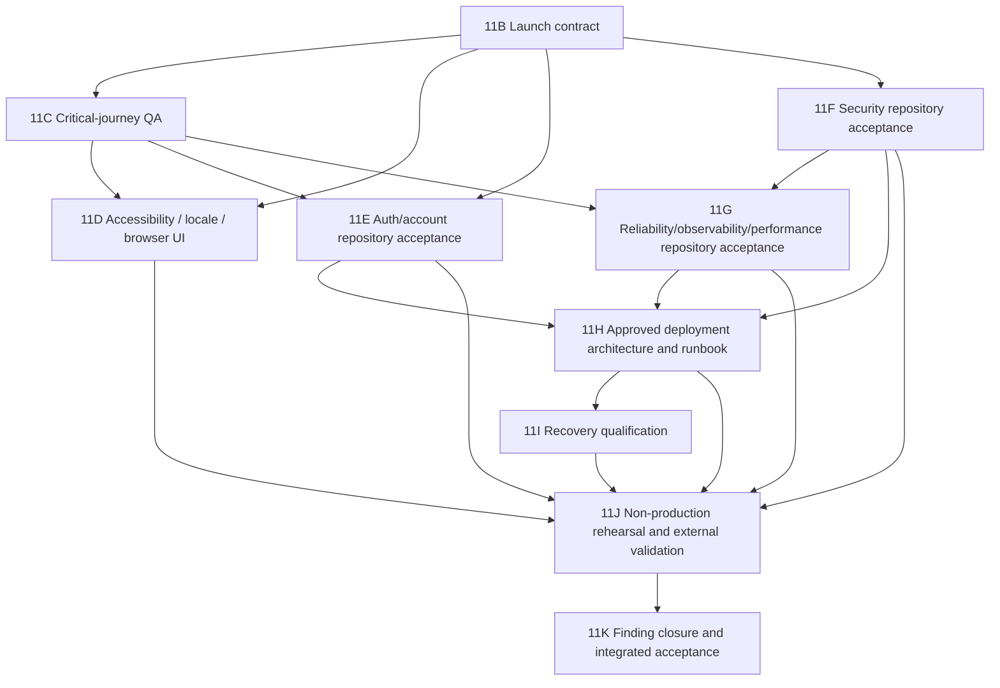

# Phase 11 QA, Hardening, and Deployment Readiness Plan

## 1. Phase 11 objective

Phase 11 converts the accepted, bounded MVP implementation into a release
candidate whose public production launch can be evaluated against explicit
product, quality, security, privacy, recovery, operational, and deployment
evidence.

Phase 11 is complete only when every P0 in
`phase-11-qa-hardening-deployment-readiness-audit.md` is closed, every P1 is
closed or explicitly accepted by its owner, required external evidence is
attached, the integrated gate passes, and a named human authority decides
whether to authorize a separate production deployment.

## 2. Phase 11 scope

Phase 11 owns:

- the launch contract and acceptance matrix;
- critical-journey QA and proportional test architecture;
- English/Hebrew, RTL, bidirectional, accessibility, responsive, browser, and
  device hardening;
- account recovery and approved account/data lifecycle;
- application, dependency, browser-header, CI, and repository security;
- reliability, performance, monitoring, and incident response;
- Preview/staging/production architecture and release runbooks;
- backup/recovery objectives and isolated restore qualification;
- non-production deployment rehearsal and smoke/rollback evidence; and
- final integrated acceptance and launch-authorization evidence.

## 3. Explicit non-goals

Phase 11 does not:

- weaken or reinterpret a Phase 10 invariant;
- implement Phase 10E.5, Phase 10F, or Phase 10G;
- approve or access a new data or barcode provider;
- change the approved Foundation-only four-nutrient projection;
- reuse initial promotion or lifecycle bootstrap for updates;
- claim the existing post-deployment backup is restore-qualified;
- perform a production restore without separate incident authorization;
- deploy production merely because Phase 11 is accepted;
- add enterprise controls without a proportional launch risk; or
- claim formal WCAG, ASVS, privacy, legal, or security certification.

## 4. Proposed launch-readiness definition

The application is launch-ready only when:

1. the product owner has approved launch audience, geography, scope, supported
   clients, support promise, and release authority;
2. every critical user journey has traceable positive, negative, data
   integrity, tenant, locale, viewport, and supported-browser evidence;
3. account confirmation/recovery and approved data/account lifecycle are
   usable and tested;
4. WCAG 2.2 AA is used as the engineering target, with automated and manual
   evidence and no unwaived launch-blocking issue;
5. no unaccepted reachable critical/high production dependency advisory
   remains;
6. server authorization, RLS, grants, secrets, headers, and supply-chain gates
   pass;
7. approved privacy, retention, export/deletion, attribution, support-access,
   and health-adjacent boundaries are implemented;
8. migration drift/order/compatibility and stop conditions are demonstrated;
9. approved performance/error/availability budgets pass at launch-shaped load;
10. named operators receive tested privacy-safe alerts and can follow incident,
    deploy, rollback, and recovery runbooks;
11. a current restricted backup restores successfully to an isolated
    launch-shaped recovery environment within the approved objectives;
12. Preview/release rehearsal proves build, environment, Auth redirects,
    migration order, smoke, observability, rollback/redeploy, and evidence
    capture; and
13. the integrated Phase 11 gate and independent review pass with no pending,
    failing, cancelled, skipped-without-rationale, or unexplained required gate.

## 5. Approved product-owner decisions and remaining deadlines

Maor Pichhadze approved all recommended Phase 11B decisions on 2026-07-31
against source head `85dec5e35a6d7aedb8fa265d30d3be27ece27282` and accepted
the three roles recorded in the launch contract. The table retains the
downstream timing controlled by those approved decisions. Later assignees,
qualified reviews, implementation, and external evidence remain due at their
exact slice deadlines.

| Decision | Needed before |
| --- | --- |
| Launch audience, geography, availability level, support promise, and release approver | Phase 11B completion |
| Exact MVP/deferred surface, including provider-disabled barcode and camera claims | Phase 11B completion |
| Auth confirmation, recovery, OAuth, reauthentication, and account lifecycle | Phase 11E scope |
| Locale detection/persistence and supported bilingual behavior | Phase 11D scope |
| WCAG target and browser/device/assistive-tech support matrix | Phase 11D scope |
| Privacy/terms/consent, retention, export/deletion, support/admin access, USDA attribution, and health disclaimer | Phase 11E scope; legal review |
| Expected volume, performance budgets, SLOs, alerts, incident owners, and escalation | Phase 11G scope |
| Preview/staging/production topology, Supabase separation, domain, secret owners, maintenance window, and release authority | Phase 11H scope |
| Backup scope, retention, RPO, RTO, owners, and recurring qualification | Phase 11I scope |
| Explicit acceptance of any remaining P1, with owner and expiry | Phase 11K |

## 6. Required external evidence

External evidence must remain attributed and must not be rewritten as
repository-verified fact:

- privacy/legal and native-speaker review;
- manual accessibility and physical-device evidence;
- current dependency advisory/reachability analysis;
- GitHub governance/security settings;
- hosted Supabase Auth, migration, and environment evidence;
- deployed response headers, performance, monitoring, and uptime evidence;
- Vercel project/environment/domain/deployment evidence;
- restricted backup and isolated restore evidence; and
- observed deploy, rollback/redeploy, incident, and operator walkthroughs.

## 7. Completion model and dependency graph

Phase 11 uses two separate acceptance stages for findings whose final proof
requires hosted, deployed, physical-device, legal, operational, or recovery
evidence:

1. `IMPLEMENTATION_COMPLETE_EXTERNAL_VALIDATION_PENDING` means the approved
   repository contract is implemented, local and CI evidence passes, and the
   required configuration schemas, tests, runbooks, evidence checklist, and
   stop conditions exist. The implementation slice may complete, but the
   finding remains open and no external operation is implied.
2. `EXTERNAL_VALIDATION_COMPLETE` means the designated later validation slice
   collected the exact attributable evidence under separate authorization.
   Phase 11K must verify both stages before assigning `FINDING_CLOSED`.

An implementation PR merge never closes a finding that requires external
evidence. Pending external validation must remain explicit in the PR and phase
status.

11D–11G may use separate focused PRs and overlap where their prerequisite
decisions and repository contracts are complete. The 11E–11G edges into 11H
represent completed bounded repository contracts, not closed launch findings.
Phase 11H defines the architecture that 11J later exercises; 11J collects all
explicitly deferred hosted/deployed evidence under separate authorization; and
11K performs final closure. This keeps the graph acyclic without moving or
renaming a slice.

## 8. Phase 11B — Launch contract and acceptance baseline

**Current status:** Phase 11B is `PHASE_11B_COMPLETE` for its bounded
documentation, product-decision, acceptance-contract, and handoff scope. The
[accepted launch contract and acceptance baseline](phase-11b-launch-contract-and-acceptance-baseline.md)
is version `1.0-phase-11b-accepted`: Maor Pichhadze approved all 30
recommendations against owner-reviewed source head
`85dec5e35a6d7aedb8fa265d30d3be27ece27282`, accepted the product-owner,
launch-decision-authority, and Production-approver roles, and approved the
recommended release-separation policy. Independent review accepted recording
head `c739df46d960593d0a2306255cdb0b46df29f4bc` on 2026-07-31. Phase 11C1's
bounded critical-journey traceability foundation and auth/session coverage
merged into `main` through PR #73 at squash commit
`c537f65ed598832e11015266d615c295a4504d06`. Push-triggered Validate run
`30697381368`, job `91362444133`, succeeded on that exact SHA. Phase 11C2A
correctness remediation, Phase 11C2B linked-food remediation, and bounded
Phase 11C2B core-loop acceptance subsequently merged. Independent review
accepted PR #77 source `644b552f7db5bb8bf3693ea5c22941875b5b3764`, squash
`18eae73a91d8e0156702b42bf8327af6ef7e6c9f`, and post-merge run
`31243356983` / Validate job `93067794693`. Phase 11C remains active and
incomplete. This transition authorizes no hosted access,
finding closure, Production release, or deployment. Overall Phase 11 remains
incomplete, and the dependency graph and two-stage evidence model above remain
controlling.

### Objective

Resolve the decisions that determine what “ready” means and convert the audit
into a traceable acceptance baseline.

### Authorized scope

- Approve launch model, geography, MVP/deferred surface, support promise,
  supported client matrix, accessibility target, account/privacy/recovery
  policy owners, performance/availability objectives, and release authority.
- Create a finding/decision/evidence register and critical-journey matrix.
- Define P1 exception format: owner, rationale, compensating control, expiry.

### Non-goals

No executable change, provider selection, deployment, production access,
backup, restore, or risk acceptance by Codex.

### Acceptance criteria

- Every audit product decision has a named owner and approved answer.
- Every P0/P1 maps to one slice and acceptance gate.
- The launch model makes provider-disabled barcode and camera claims explicit.
- Conditional Phase 10 branches and restore boundaries remain unchanged.

### Validation strategy

Independent cross-document review, decision-owner sign-off, finding-to-slice
trace, and contradiction/link checks.

## 9. Phase 11C — Critical-journey QA foundation

**Current status:** Phase 11C1's
[critical-journey traceability foundation](phase-11c-critical-journey-qa-foundation.md)
and bounded auth/session coverage are present on `main` through PR #73, but
Phase 11C also now contains the independently accepted Phase 11C2A and 11C2B
bounded automated evidence through current `main`
`18eae73a91d8e0156702b42bf8327af6ef7e6c9f`. CJ-009 through CJ-015 have
accepted bounded automated coverage; the reconciled map contains 35 journeys,
70 automated references, 266 automated axis claims, and unchanged
no-JavaScript totals `6 / 1 / 10 / 18`. Phase 11C nevertheless remains active
and incomplete. `P11A-002` and `P11A-015` remain `OPEN`, as do all 18
findings. Signed manual exploratory evidence remains absent. Phase 11D, Phase
11E, Phase 11G, and Phase 11J retain their existing responsibilities, Phase
11K remains the exclusive finding-closure gate, and no hosted access or
deployment is authorized.

### Objective

Make CI and manual QA prove the launch-critical product loop rather than
accumulate unstructured feature tests.

### Authorized scope

- Add end-to-end sign-up, sign-in, sign-out, expired-session, first setup,
  target update, diary CRUD, search/prefill, custom-food, favorites/recents,
  Saved Meal, Recipe, and barcode baseline journeys.
- Trace negative/stale/archive/unavailable/conflict/rollback/retry states,
  integrity, tenant isolation, locale, viewport, browser, and no-JavaScript
  requirements proportionally.
- Refactor fixtures only where needed for stable isolation and add suitable
  failure artifacts or partitioning without weakening the full gate.

### Non-goals

No auth recovery feature, accessibility certification, cross-browser support
claim, deployment, or broad test rewrite.

### Acceptance criteria

- The approved journey matrix links to executable/manual evidence.
- Auth access journeys no longer rely only on provisioning helpers.
- No critical path lacks explicit data-integrity and tenant assertions.
- CI remains deterministic, local-Supabase-only for database mutation, and
  cleans up on all outcomes.

### Validation strategy

Focused local tests during development and the authoritative GitHub matrix;
manual checklist evidence for non-automatable cases.

## 10. Phase 11D — Accessibility, localization, responsive, and browser UI

### Objective

Meet the approved bilingual accessibility and supported-client contract without
overstating certification or physical support.

### Authorized scope

- Add bounded automated accessibility checks and remediate verified semantics,
  focus, error/status, landmark, contrast, reflow, target, and motion issues.
- Preserve route/date/meal context through approved locale switching and
  centralize locale-aware number/date display where required.
- Add approved Firefox/WebKit/mobile/visual coverage and fix verified
  RTL/overflow/layout defects.
- Execute manual keyboard, zoom/reflow, screen-reader, native-speaker, and
  deterministic camera checks; define the physical-device/camera evidence
  checklist and keep manual barcode lookup universal.

### Non-goals

No formal WCAG certification, unsupported camera promise, third-party decoder,
external barcode provider, or redesign unrelated to verified findings.

### Acceptance criteria

- Zero unwaived serious automated accessibility findings.
- Every critical journey passes the approved manual accessibility checklist.
- English/Hebrew copy/context/RTL and long mixed content pass supported clients.
- Firefox/WebKit/mobile automation and visual evidence match the support
  matrix; the required physical-device evidence checklist and stop conditions
  are exact.
- Camera failure always preserves complete manual/no-JavaScript lookup.
- `P11A-005` is recorded as
  `IMPLEMENTATION_COMPLETE_EXTERNAL_VALIDATION_PENDING` until Phase 11J
  collects the required physical-device/deployed-browser evidence.

### Validation strategy

Automated accessibility and browser projects, visual baselines where stable,
native-speaker review, manual AT/zoom/keyboard, and deterministic camera tests.
Physical-device records are deferred to separately authorized Phase 11J
evidence collection.

## 11. Phase 11E — Authentication and account lifecycle

### Objective

Prevent account lockout and implement only the account/data lifecycle approved
by product, privacy, and legal owners.

### Authorized scope

- Add approved Auth callback, email-confirmation, reset request/completion,
  recovery, enumeration-safe messaging, strict redirect, and reauthentication.
- Implement approved data export, account closure/deletion, retention, and
  support procedures with server-derived identity, authenticated-only
  mutations, RLS, least privilege, and complete cascade/retention semantics.
- Add localized notices/consent, USDA attribution, and health-adjacent copy
  required by the approved policy.

### Non-goals

No OAuth unless explicitly approved; no dashboard-only schema; no hard deletion
that contradicts approved snapshot, receipt, ingestion, backup, or legal holds.

### Acceptance criteria

- Approved account access flows complete in both locales and resist open
  redirects and enumeration.
- Export/closure/deletion/retention behavior matches approved policy and has
  exact database/application tests.
- Sensitive actions require approved recent authentication.
- An exact hosted-configuration checklist covers Auth/site URLs, redirect
  allow-lists, SMTP, confirmation settings, rate limits, cookies, deployed
  redirect behavior, attribution, authorization boundaries, and stop
  conditions.
- Local and CI evidence passes and `P11A-006` is recorded as
  `IMPLEMENTATION_COMPLETE_EXTERNAL_VALIDATION_PENDING`; Phase 11E does not
  claim hosted configuration or deployed behavior was verified.

### Validation strategy

Local email-capture and browser tests, migration/RLS/grant/cascade assertions
if schema is required, privacy data-flow review, configuration-schema/checklist
review, and complete CI. Hosted configuration and deployed redirect/cookie
preflight are deferred to separately authorized Phase 11J evidence collection.

## 12. Phase 11F — Application and supply-chain security

### Objective

Close concrete dependency/browser/CI/governance risks while preserving the
existing authorization and ingestion security model.

### Authorized scope

- Obtain and triage every current dependency advisory; perform minimal
  reviewed updates in a separately approved executable PR.
- Threat-model and test production headers/CSP, frame/referrer/MIME/camera
  policies, error leakage, origin behavior, secret boundaries, and abuse
  assumptions.
- Add proportional dependency/static-analysis gates; review and, if approved,
  pin GitHub Actions.
- Inspect GitHub branch/review/check/scanning/merge settings read-only and
  document required owner changes separately.

### Non-goals

No destructive/remote attack, secret creation/exposure, GitHub settings
mutation, provider change, ASVS certification, or weakening of RLS/grants.

### Acceptance criteria

- No unaccepted reachable critical/high production advisory.
- Approved security-header/CSP configuration exists and passes unit,
  configuration, and local compatibility tests without weakening Auth or
  camera fallback.
- Secret scans and server/client environment boundaries pass.
- RLS, grants, `SECURITY DEFINER` ownership/empty `search_path`, authenticated
  mutation, and tenant isolation remain green.
- GitHub governance evidence matches the approved release policy.
- `P11A-008` is recorded as
  `IMPLEMENTATION_COMPLETE_EXTERNAL_VALIDATION_PENDING`; actual response-header
  and CSP compatibility evidence remains a Phase 11J gate.

### Validation strategy

Advisory/reachability report, dependency diff/regression, header
unit/configuration and local compatibility tests, static analysis, secret scan,
complete CI, and read-only GitHub settings evidence. Deployed header/CSP smoke
is deferred to separately authorized Phase 11J evidence collection.

## 13. Phase 11G — Reliability, observability, and performance

### Objective

Make failures detectable, recoverable, privacy-safe, and proportionate to the
approved launch volume.

### Authorized scope

- Add localized global/route failure boundaries and approved outage,
  interruption, retry, maintenance, and version-mismatch behavior.
- Define structured privacy-safe logs, errors, performance, uptime/health,
  Auth/database/deployment signals, thresholds, owners, retention, escalation,
  status communication, and incident review.
- Implement the approved provider-neutral repository instrumentation contract
  and synthetic/local signal adapters without creating or configuring a
  provider account.
- Add launch-shaped synthetic data/query/browser/load evidence against approved
  budgets, without using production personal data.

### Non-goals

No provider account/credential without authorization, production load attack,
personal-data logging, or universal performance guarantee.

### Acceptance criteria

- Approved failure injection preserves safe UI and mutation integrity.
- The provider-neutral telemetry contract, privacy-safe event model,
  instrumentation boundaries, alert policy, named ownership, and incident
  runbook exist; local/synthetic signal and tabletop evidence passes.
- Logs exclude credentials, raw camera frames, unnecessary personal/nutrition
  data, and provider raw data.
- Approved synthetic fixtures, query tests, build analysis, and bounded local
  route/query/error budgets pass at launch-shaped volume.
- `P11A-012`, `P11A-013`, and `P11A-014` are recorded as
  `IMPLEMENTATION_COMPLETE_EXTERNAL_VALIDATION_PENDING`; actual Preview/staging
  telemetry, alert delivery, deployed timings/Core Web Vitals, cold starts,
  uptime/deployment notifications, and observed incident evidence remain Phase
  11J gates.

### Validation strategy

Local injected failures, synthetic data and bounded load, query plans, browser
performance fixtures, instrumentation contract/privacy tests, synthetic signal
delivery, incident tabletop, and complete CI. Provider configuration,
Preview/staging telemetry and alert delivery, deployed performance/Core Web
Vitals, and incident/outage rehearsal are deferred to separately authorized
Phase 11J evidence collection.

## 14. Phase 11H — Deployment architecture and release runbook

### Objective

Approve a safe environment architecture and deterministic release procedure
before any deployment is attempted.

### Authorized scope

- Define Preview, optional staging, production, domains/HTTPS, Node/build,
  environment variables, Supabase separation, Preview database strategy, Auth
  URLs, secret owners, validation, migration order, compatibility, maintenance,
  smoke, rollback/redeploy, backup gates, approvals, and evidence.
- Add only reviewed repository configuration and environment documentation.
- Define exact preflight and stop conditions, including remote Supabase
  authorization boundaries.

### Non-goals

No Vercel project creation, deployment, domain/DNS, credential, remote Supabase
query/mutation, backup, or restore in the architecture PR.

### Acceptance criteria

- Every environment and secret has one purpose, owner, and isolation rule.
- Database/app ordering, compatibility, rollback limitations, smoke, backup,
  and stop conditions are executable and reviewed.
- Preview cannot silently target production data.
- Production release remains a separate explicit authorization.
- `P11A-010` and `P11A-017` remain
  `IMPLEMENTATION_COMPLETE_EXTERNAL_VALIDATION_PENDING`; Phase 11H makes no
  remote configuration, deployment, drift, or rehearsal claim.

### Validation strategy

Configuration schema checks, local build/env checks, threat model, runbook
tabletop, and independent review.

## 15. Phase 11I — Recovery qualification

### Objective

Prove that a current launch-shaped backup can restore a usable, secure system
within the approved recovery objectives.

### Authorized scope

- Under a separate exact authorization, create or select a restricted fresh
  backup covering the approved Postgres/Auth/roles/grants/storage scope.
- Restore only to an isolated recovery environment.
- Verify manifests/hashes, schema/history, owners/grants/RLS, Auth scope,
  application data, snapshots, ingestion evidence, smoke, post-restore
  operations, timing, teardown, owners, and stop conditions.
- Record the existing Phase 10E post-deployment backup as `not_tested` unless
  that exact backup is separately selected and qualified.

### Non-goals

No production restore, incident declaration, provider operation beyond the
exact separately authorized restricted backup/isolated-restore scope,
migration repair, or reuse of promotion/bootstrap.

### Acceptance criteria

- The approved backup restores successfully in isolation within RPO/RTO.
- Application/security/data-integrity checks pass and evidence is attributable.
- The runbook identifies authority, escalation, stop, and production-restore
  boundaries.
- Recurring qualification and retention ownership are scheduled.

### Validation strategy

Artifact hash checks, isolated restore, database/Auth/role verification,
application smoke, timing, and independent operator review.

## 16. Phase 11J — Preview and release rehearsal

### Objective

Exercise the complete non-production release loop using the approved
architecture, controls, and recovery evidence.

### Authorized scope

- Under separate authorization, create/link the approved Vercel project and
  configure only non-production environment scope.
- Deploy Preview or staging, apply the approved non-production migration
  sequence where needed, run deployment smoke, observe signals, rehearse
  rollback/redeploy, and capture evidence.
- Collect every hosted/deployed validation explicitly deferred by earlier
  slices: hosted Supabase Auth/site URLs, SMTP, confirmation, rate limits,
  cookies, and redirect behavior; response headers and CSP/Auth/camera
  compatibility; monitoring provider configuration, privacy-safe signal and
  alert delivery, uptime, and deployment notifications; Preview/staging route,
  query, cold-start, timing, and Core Web Vitals evidence; outage/incident
  rehearsal; physical-device/deployed-browser checks; and non-production
  migration drift/order preflight.
- Rehearse the production checklist without production mutation/deployment.

### Non-goals

No production deployment/domain switch, production Supabase mutation,
production provider operation, provider configuration beyond the exact
separately authorized non-production scope, production restore, or launch
authorization.

### Acceptance criteria

- Preview/staging uses the exact intended source and isolated data target.
- Build, environment, migration, hosted Auth/redirect/cookie, security-header/
  CSP, smoke, monitoring/alert/notification, deployed performance/Core Web
  Vitals, outage/incident, rollback/redeploy, physical-device where required,
  and cleanup gates pass.
- Every external-validation item deferred from 11D–11G is either attributable
  and `EXTERNAL_VALIDATION_COMPLETE` or remains explicitly open with owner,
  reason, and stop status. Phase 11J does not assign `FINDING_CLOSED`.
- Required failures stop the rehearsal and are explained/corrected.
- The evidence packet is complete enough for independent Phase 11 acceptance.

### Validation strategy

Attributed provider/host configuration exports, deployment logs, environment
assertions, Auth and smoke journeys, response headers/CSP checks, telemetry/
uptime/alert/notification delivery, deployed browser performance and Core Web
Vitals, outage/incident drill, physical-device checks where required,
rollback/redeploy, cleanup, and final non-production state verification.

## 17. Phase 11K — Integrated acceptance and launch-authorization gate

### Objective

Audit Phase 11 evidence as one system and decide only whether launch
authorization may be requested.

### Authorized scope

- Re-run the complete authoritative CI and required external checklist.
- Verify all 16 domains, P0/P1 disposition, product decisions, external
  evidence, Phase 10 boundaries, current dependency state, deployment/recovery
  runbooks, rehearsal, owners, and exact release candidate.
- For every finding, verify repository/local implementation and any deferred
  external validation as separate attributable stages before assigning
  `FINDING_CLOSED`.
- Publish a Phase 11 acceptance report and launch checklist.

### Non-goals

No production deployment, DNS/domain switch, production mutation, provider
operation, backup, or restore.

### Acceptance criteria

- Zero open P0.
- Every P1 is closed or has an explicit owner-approved, time-bounded exception.
- No finding is closed solely because its implementation PR merged. Every
  `FINDING_CLOSED` disposition has both required stages; every incomplete
  external stage remains open rather than being inferred from repository
  evidence.
- Every required CI/external gate passes with no pending, failing, cancelled,
  or unexplained skipped result.
- The exact candidate SHA, configuration, evidence, and rollback/recovery
  boundaries are recorded.
- Every still-open or explicitly accepted P1 risk is recorded with owner,
  rationale, expiry where applicable, compensating control, and launch effect.
- Independent review is complete and no material Phase 10 invariant is open.

### Validation strategy

Finding-by-finding two-stage evidence audit, exact changed/release-state
verification, CI, external checklist, independent review, and final owner
sign-off.

## 18. Slice capability and authorization matrix

`Repository/local` is the bounded implementation stage. `Conditional` means
the capability belongs to that slice only after a separate exact human
authorization and approved design; it does not grant authority. `No` means the
capability is outside the slice.

| Slice | Repository/local implementation | Local/CI validation | Remote read-only verification | Remote mutation | Provider configuration | Vercel setup | Non-production deployment | External evidence | Backup / isolated restore | Final finding closure |
| --- | --- | --- | --- | --- | --- | --- | --- | --- | --- | --- |
| 11B Launch contract | Docs/decisions | Yes | No | No | No | No | No | Owner/legal input only | No | No |
| 11C Critical QA | Code/tests/docs as approved | Yes | No | No | No | No | No | Signed manual QA where required | No | No |
| 11D Accessibility/locale/browser | Code/tests/docs as approved | Yes | No | No | No | No | No | Native-speaker/AT/manual evidence; deployed/physical remainder deferred to 11J | No | No |
| 11E Auth/account lifecycle | Code/tests/schema/docs as approved | Yes | No | No | No | No | No | Legal/privacy evidence; hosted Auth evidence deferred to 11J | No | No |
| 11F Security/supply chain | Code/tests/config/docs as approved | Yes | Conditional GitHub/settings/advisory reads | No | No | No | No | Advisory/governance evidence; deployed headers deferred to 11J | No | No |
| 11G Reliability/observability/performance | Code/tests/instrumentation/docs as approved | Yes | No | No | No | No | No | Provider/deployed signal/performance/incident evidence deferred to 11J | No | No |
| 11H Deployment architecture | Repository config/docs only | Yes | No | No | No | No | No | Architecture/runbook review only | No | No |
| 11I Recovery qualification | Verification/docs only | Conditional local checks | Conditional backup metadata reads | No | No | No | No | Restricted recovery evidence | Conditional / conditional isolated only | No |
| 11J Preview/release rehearsal | Non-production config/tests/docs only | Yes | Conditional | Conditional non-production only | Conditional non-production only | Conditional | Conditional non-production only | Yes, attributable deferred evidence | Conditional backup gate / no production restore | No |
| 11K Integrated acceptance | Acceptance docs only | Yes | Conditional verification | No | No new configuration | No | No new deployment | Verify complete evidence packet | No new backup or restore | Yes, where both stages pass |

No matrix cell authorizes remote Supabase access or mutation, provider access
or configuration, Vercel setup, deployment, backup, or restore. Each
conditional external action requires its own exact human authorization; this
plan and any earlier slice are not that authorization.

## 19. Final Phase 11 integrated acceptance gate

The final gate must record:

- exact repository/candidate SHA and clean branch/PR state;
- status of all 16 domains and every finding/decision/evidence item;
- exact CI workflows, jobs, matrices, counts, duration, failures/skips, and
  artifacts;
- bilingual/accessibility/browser/device/manual evidence;
- dependency/security/settings/header evidence;
- privacy/account lifecycle approval and tests;
- database drift/order/compatibility evidence;
- performance/reliability/monitoring/incident evidence;
- recovery qualification with the exact backup and isolated restore status;
- Preview/rehearsal deployment, smoke, and rollback/redeploy evidence;
- all owner approvals and P1 exceptions;
- unchanged Phase 10 conditional/provider/update boundaries; and
- a precise list of production actions that did and did not occur.

Passing Phase 11 means only that the exact release candidate is eligible for a
separate launch authorization.

## 20. Final launch-authorization boundary

Phase 11A is planning, not implementation. Later Phase 11 slices are hardening
and rehearsal, not implicit production authority. Even after Phase 11K passes:

- production deployment requires a separate exact human authorization;
- production Supabase mutation requires its own exact approved procedure;
- a production restore requires separate explicit incident authorization;
- any provider or Phase 10E.5/10F/10G operation remains separately gated; and
- launch must stop if the candidate SHA, environment, migration state, required
  check, backup/recovery evidence, or approval differs from the accepted packet.
