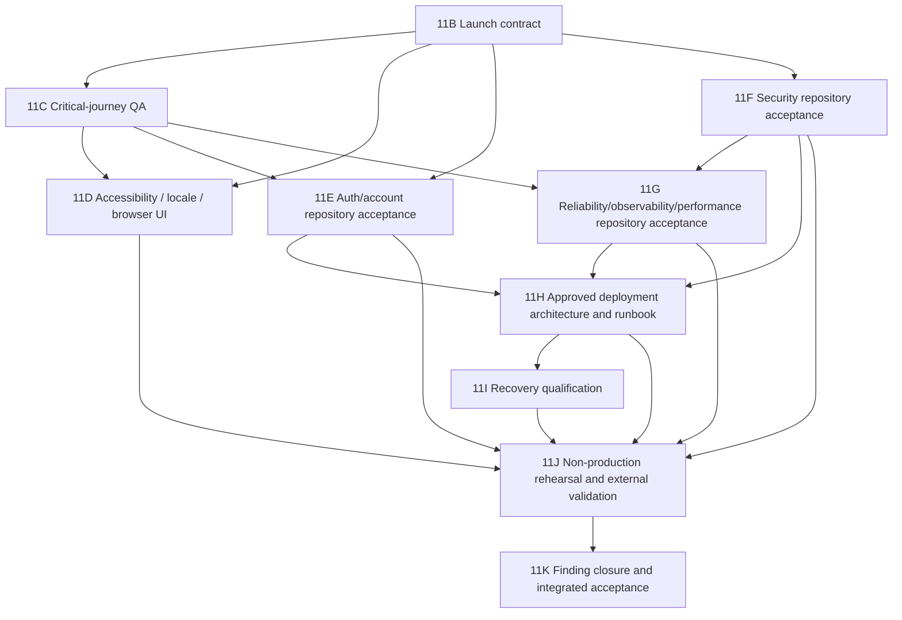

# Phase 11 QA, Hardening, and Deployment Readiness Plan

## 1. Phase 11 objective

Phase 11 converts the accepted, bounded MVP implementation into a release
candidate whose public production launch can be evaluated against explicit
product, quality, security, privacy, recovery, operational, and deployment
evidence.

Phase 11 is complete only when every P0 in
`phase-11-qa-hardening-deployment-readiness-audit.md` is closed, every P1 is
closed or explicitly accepted by its owner, required external evidence is
attached, the integrated gate passes, and a named human authority decides
whether to authorize a separate production deployment.

## 2. Phase 11 scope

Phase 11 owns:

- the launch contract and acceptance matrix;
- critical-journey QA and proportional test architecture;
- English/Hebrew, RTL, bidirectional, accessibility, responsive, browser, and
  device hardening;
- account recovery and approved account/data lifecycle;
- application, dependency, browser-header, CI, and repository security;
- reliability, performance, monitoring, and incident response;
- Preview/staging/production architecture and release runbooks;
- backup/recovery objectives and isolated restore qualification;
- non-production deployment rehearsal and smoke/rollback evidence; and
- final integrated acceptance and launch-authorization evidence.

## 3. Explicit non-goals

Phase 11 does not:

- weaken or reinterpret a Phase 10 invariant;
- implement Phase 10E.5, Phase 10F, or Phase 10G;
- approve or access a new data or barcode provider;
- change the approved Foundation-only four-nutrient projection;
- reuse initial promotion or lifecycle bootstrap for updates;
- claim the existing post-deployment backup is restore-qualified;
- perform a production restore without separate incident authorization;
- deploy production merely because Phase 11 is accepted;
- add enterprise controls without a proportional launch risk; or
- claim formal WCAG, ASVS, privacy, legal, or security certification.

## 4. Proposed launch-readiness definition

The application is launch-ready only when:

1. the product owner has approved launch audience, geography, scope, supported
   clients, support promise, and release authority;
2. every critical user journey has traceable positive, negative, data
   integrity, tenant, locale, viewport, and supported-browser evidence;
3. account confirmation/recovery and approved data/account lifecycle are
   usable and tested;
4. WCAG 2.2 AA is used as the engineering target, with automated and manual
   evidence and no unwaived launch-blocking issue;
5. no unaccepted reachable critical/high production dependency advisory
   remains;
6. server authorization, RLS, grants, secrets, headers, and supply-chain gates
   pass;
7. approved privacy, retention, export/deletion, attribution, support-access,
   and health-adjacent boundaries are implemented;
8. migration drift/order/compatibility and stop conditions are demonstrated;
9. approved performance/error/availability budgets pass at launch-shaped load;
10. named operators receive tested privacy-safe alerts and can follow incident,
    deploy, rollback, and recovery runbooks;
11. a current restricted backup restores successfully to an isolated
    launch-shaped recovery environment within the approved objectives;
12. Preview/release rehearsal proves build, environment, Auth redirects,
    migration order, smoke, observability, rollback/redeploy, and evidence
    capture; and
13. the integrated Phase 11 gate and independent review pass with no pending,
    failing, cancelled, skipped-without-rationale, or unexplained required gate.

## 5. Approved product-owner decisions and remaining deadlines

Maor Pichhadze approved all recommended Phase 11B decisions on 2026-07-31
against source head `85dec5e35a6d7aedb8fa265d30d3be27ece27282` and accepted
the three roles recorded in the launch contract. The table retains the
downstream timing controlled by those approved decisions. Later assignees,
qualified reviews, implementation, and external evidence remain due at their
exact slice deadlines.

| Decision | Needed before |
| --- | --- |
| Launch audience, geography, availability level, support promise, and release approver | Phase 11B completion |
| Exact MVP/deferred surface, including provider-disabled barcode and camera claims | Phase 11B completion |
| Auth confirmation, recovery, OAuth, reauthentication, and account lifecycle | Phase 11E scope |
| Locale detection/persistence and supported bilingual behavior | Phase 11D scope |
| WCAG target and browser/device/assistive-tech support matrix | Phase 11D scope |
| Privacy/terms/consent, retention, export/deletion, support/admin access, USDA attribution, and health disclaimer | Phase 11E scope; legal review |
| Expected volume, performance budgets, SLOs, alerts, incident owners, and escalation | Phase 11G scope |
| Preview/staging/production topology, Supabase separation, domain, secret owners, maintenance window, and release authority | Phase 11H scope |
| Backup scope, retention, RPO, RTO, owners, and recurring qualification | Phase 11I scope |
| Explicit acceptance of any remaining P1, with owner and expiry | Phase 11K |

## 6. Required external evidence

External evidence must remain attributed and must not be rewritten as
repository-verified fact:

- privacy/legal and native-speaker review;
- manual accessibility and physical-device evidence;
- current dependency advisory/reachability analysis;
- GitHub governance/security settings;
- hosted Supabase Auth, migration, and environment evidence;
- deployed response headers, performance, monitoring, and uptime evidence;
- Vercel project/environment/domain/deployment evidence;
- restricted backup and isolated restore evidence; and
- observed deploy, rollback/redeploy, incident, and operator walkthroughs.

## 7. Completion model and dependency graph

Phase 11 uses two separate acceptance stages for findings whose final proof
requires hosted, deployed, physical-device, legal, operational, or recovery
evidence:

1. `IMPLEMENTATION_COMPLETE_EXTERNAL_VALIDATION_PENDING` means the approved
   repository contract is implemented, local and CI evidence passes, and the
   required configuration schemas, tests, runbooks, evidence checklist, and
   stop conditions exist. The implementation slice may complete, but the
   finding remains open and no external operation is implied.
2. `EXTERNAL_VALIDATION_COMPLETE` means the designated later validation slice
   collected the exact attributable evidence under separate authorization.
   Phase 11K must verify both stages before assigning `FINDING_CLOSED`.

An implementation PR merge never closes a finding that requires external
evidence. Pending external validation must remain explicit in the PR and phase
status.

11D–11G may use separate focused PRs and overlap where their prerequisite
decisions and repository contracts are complete. The 11E–11G edges into 11H
represent completed bounded repository contracts, not closed launch findings.
Phase 11H defines the architecture that 11J later exercises; 11J collects all
explicitly deferred final UI-dependent human and hosted/deployed evidence under
separate authorization; and 11K performs final closure. This keeps the graph
acyclic without moving or renaming a slice.

## 8. Phase 11B — Launch contract and acceptance baseline

**Current status:** Phase 11B is `PHASE_11B_COMPLETE` for its bounded
documentation, product-decision, acceptance-contract, and handoff scope. The
[launch contract and acceptance baseline](phase-11b-launch-contract-and-acceptance-baseline.md)
preserves original version `1.0-phase-11b-accepted` and is amended as candidate
version `1.6-phase-11e-nojs-classifications-amended`, while historical amended
versions `1.1-phase-11b-cj019-amended`,
`1.2-phase-11b-cj019-cj030-amended`,
`1.3-phase-11b-cj024-cj027-nojs-amended`,
`1.4-phase-11b-remaining-implemented-nojs-amended`, and
`1.5-phase-11b-ui-dependent-manual-acceptance-timing-amended` remain preserved: Maor Pichhadze
approved all
30 recommendations
against owner-reviewed source head
`85dec5e35a6d7aedb8fa265d30d3be27ece27282`, accepted the product-owner,
launch-decision-authority, and Production-approver roles, and approved the
recommended release-separation policy. Independent review accepted recording
head `c739df46d960593d0a2306255cdb0b46df29f4bc` on 2026-07-31. Phase 11C1's
bounded critical-journey traceability foundation and auth/session coverage
merged into `main` through PR #73 at squash commit
`c537f65ed598832e11015266d615c295a4504d06`. Push-triggered Validate run
`30697381368`, job `91362444133`, succeeded on that exact SHA. Phase 11C2A
correctness remediation, Phase 11C2B linked-food remediation, and bounded
Phase 11C2B core-loop acceptance subsequently merged. Independent review
accepted PR #77 source `644b552f7db5bb8bf3693ea5c22941875b5b3764`.
PRs #79, #80, and #82 corrected CJ-019 concurrency, CJ-016 no-JavaScript
history synchronization, and CJ-019 authoritative recovery. Independent review
accepted PR #83 source `818e19d46863dd1f807e27ee63a61bcb550d2c53` and squash
`494907b2c2f34ed49771aef75fd3137a522857e9`; superseded PR #81 was closed
unmerged. Independent review then accepted PR #84 source
`cc869dbedd4748b1ef0124a18379f75aaf4027d3`, squash
`afce415350d391bd32f4c3bce562192c6f3d9602`, and post-merge run
`31281033063` / Validate job `93162236075`. On 2026-08-09, Maor Pichhadze
approved CJ-019 Option B: an owner may edit an archived custom food while the
edit preserves archived/search-hidden state and restore remains separate. The
accepted behavior matches the amended contract, resolving only that product
discrepancy. At that historical transition, Phase 11C remained active and
incomplete. This transition
authorizes no hosted access, finding closure, Production release, deployment,
or later Phase 11 work. Overall Phase 11 remains incomplete, and the dependency
graph and two-stage evidence model above remain controlling.

### Objective

Resolve the decisions that determine what “ready” means and convert the audit
into a traceable acceptance baseline.

### Authorized scope

- Approve launch model, geography, MVP/deferred surface, support promise,
  supported client matrix, accessibility target, account/privacy/recovery
  policy owners, performance/availability objectives, and release authority.
- Create a finding/decision/evidence register and critical-journey matrix.
- Define P1 exception format: owner, rationale, compensating control, expiry.

### Non-goals

No executable change, provider selection, deployment, production access,
backup, restore, or risk acceptance by Codex.

### Acceptance criteria

- Every audit product decision has a named owner and approved answer.
- Every P0/P1 maps to one slice and acceptance gate.
- The launch model makes provider-disabled barcode and camera claims explicit.
- Conditional Phase 10 branches and restore boundaries remain unchanged.

### Validation strategy

Independent cross-document review, decision-owner sign-off, finding-to-slice
trace, and contradiction/link checks.

## 9. Phase 11C — Critical-journey QA foundation

**Current status:** Phase 11C1's
[critical-journey traceability foundation](phase-11c-critical-journey-qa-foundation.md)
and bounded auth/session coverage are present on `main` through PR #73, but
Phase 11C also contains the previously accepted bounded CJ-009–CJ-021
automated evidence. The independently accepted bounded CJ-022–CJ-027
reconciliation in PR #86 established the accepted evidence baseline
`483df9479ef8b2381da2faef2971c20456404102`. The evidence map validated at
that baseline contains 35
journeys, 168 automated references, and 539 automated axis claims after exact
test-body review, with no test-file or behavior change and unchanged
no-JavaScript totals `6 / 1 / 10 / 18`; CJ-024 and CJ-027 no-JavaScript remain
`NOT_VERIFIED`. The 2026-08-09 CJ-019 Option B decision aligns the archived-edit
contract with accepted behavior without adding evidence or completing the
CJ-019 matrix. The owner-approved 2026-08-09 CJ-030 Option A amendment keeps
the no-JavaScript classification `NOT_APPLICABLE`; existing disabled-
JavaScript creation behavior is non-contractual, receives no no-JavaScript
evidence credit, and is unchanged. The contradictory no-mutation validation
instruction is retired. Independently accepted PR #89 established a 35 / 216 /
694 evidence baseline. Independently accepted PR #90 then added the bounded
CJ-005 failure/retry remediation and established the repository evidence
baseline of 35 journeys, 217 automated references, and 699 evidence-axis
claims. The independently accepted post-PR90 comprehensive census recorded
three exact attribution corrections, establishing 35 / 217 / 696 before new
CJ-022 evidence. The CJ-022 stale-edit remediation adds three exact references
with eleven supported claims, producing the accepted 35 / 220 / 707 inventory.
The bounded CJ-025 Recipe stale-edit remediation was independently accepted
and squash-merged through PR #92 as `main`
`d8970ff20b3bd4d1ca0fe54bb7cd5f0c554d84e5`, tree
`ecc84fc03691c3e23b614d9dd935e59e5f381ef0`, establishing the accepted
35 journeys / 223 automated references / 718 evidence-axis claims inventory
with unchanged no-JavaScript totals `6 / 1 / 10 / 18`.
That PR #92 total remains its accurate historical acceptance snapshot. The
2026-08-11 Product Owner amendment classifies CJ-024 and CJ-027
no-JavaScript as `NOT_APPLICABLE`: incidental disabled-script behavior may
continue but is non-contractual, creates no acceptance credit, and is not
authorized for behavior change. Contract 1.3 and totals `6 / 1 / 12 / 16`
remain the accurate historical PR #94 snapshot. On 2026-08-12, Product Owner
Maor Pichhadze approved CJ-004 and CJ-009–CJ-012 as `REQUIRED`,
CJ-006/CJ-013/CJ-021 as `REQUIRED_FALLBACK_ONLY`, and CJ-015 as
`NOT_APPLICABLE`. That classification amendment produced preserved historical
contract `1.4-phase-11b-remaining-implemented-nojs-amended`; historical Phase
11C no-JavaScript totals remain `11 / 4 / 13 / 7`. Current accepted contract
`1.6-phase-11e-nojs-classifications-amended` changes exactly six Phase 11E rows
and has current totals `16 / 5 / 13 / 1`; 35 / 223 / 718 remains the accurate
historical snapshot of the Phase 11C classification amendment. Accepted PRs
#96–#102 then advanced the
repository-owned Phase 11C implementation and automation through CJ-018,
CJ-004–CJ-006, CJ-012, CJ-013/CJ-021, CJ-001, CJ-009–CJ-011, and
CJ-028/CJ-029. The exact post-PR-102 inventory is 35 journeys / 249 automated
references / 854 evidence-axis claims. A fresh all-journey residual audit found
zero known repository-owned Phase 11C runtime, implementation, automation, or
evidence-attribution gaps.
Codex then executed M1–M6 through the local in-app browser against exact
post-PR-104 SHA `b09ca42873d5114130f7dd9656ae8df185affabb`, tree
`9d7875514e860b11c5fd34bfb0086bcee1b2cbfd`. Exactly 27 controlling Phase 11C
manual records are `COLLECTED_ACCEPTED`; the eight
later-slice manual records and all 35 external records remain `NOT_COLLECTED`.
ChatGPT independently found the exact PR #105 candidate head sufficient; Phase
11C is accepted and complete for its owned scope. Merge policy requires
exact-head ChatGPT re-review of the final PR head before merge. This acceptance
closes no finding and creates no later-slice or external-evidence credit.
`P11A-002` and `P11A-015` remain `OPEN`, as do all 18 findings. Phase 11D is
`IMPLEMENTATION_COMPLETE_EXTERNAL_VALIDATION_PENDING` under its amended
implementation/evidence boundary. On
2026-08-21, Product Owner Maor Pichhadze explicitly assigned
himself as the Native Hebrew reviewer and accessibility/manual-validation owner
and accepted both assignments. The two Phase 11D role-governance prerequisites
are satisfied. Current Phase 11D automated and native-copy evidence is credited
only within its exact scope; partial keyboard observations are baseline history,
not final acceptance. Phase 11D retains the bilingual, accessibility,
viewport, browser-engine, and visual implementation matrix; Phase 11E retains
auth/account lifecycle; Phase 11G retains reliability; and Phase 11J retains
final UI-dependent human, external, deployed, platform, and device evidence.
Phase 11K
remains the exclusive finding-closure gate. Overall Phase 11 remains
incomplete, and no hosted access, launch, or deployment is authorized.

### Objective

Make CI and manual QA prove the launch-critical product loop rather than
accumulate unstructured feature tests.

### Authorized scope

- Add end-to-end sign-up, sign-in, sign-out, expired-session, first setup,
  target update, diary CRUD, search/prefill, custom-food, favorites/recents,
  Saved Meal, Recipe, and barcode baseline journeys.
- Trace negative/stale/archive/unavailable/conflict/rollback/retry states,
  integrity, tenant isolation, locale, viewport, browser, and no-JavaScript
  requirements proportionally.
- Refactor fixtures only where needed for stable isolation and add suitable
  failure artifacts or partitioning without weakening the full gate.

### Non-goals

No auth recovery feature, accessibility certification, cross-browser support
claim, deployment, or broad test rewrite.

### Acceptance criteria

- The approved journey matrix links to executable/manual evidence.
- Auth access journeys no longer rely only on provisioning helpers.
- No critical path lacks explicit data-integrity and tenant assertions.
- CI remains deterministic, local-Supabase-only for database mutation, and
  cleans up on all outcomes.

### Validation strategy

Focused local tests during development and the authoritative GitHub matrix;
manual checklist evidence for non-automatable cases.

## 10. Phase 11D — Accessibility, localization, responsive, and browser UI

**Current status:** `IMPLEMENTATION_COMPLETE_EXTERNAL_VALIDATION_PENDING`.
ChatGPT independently reviewed exact head
`f05ffbadcd3cb67ff83f66baa595a19e09469692`, tree
`44601639be3d3bf79d78abc8e59d169465ffa6dd`, on 2026-08-26 and issued
`PHASE_11D_UI_DEPENDENT_MANUAL_ACCEPTANCE_TIMING_AMENDMENT_EXACT_HEAD_ACCEPTED`
with verdict `APPROVE`. This accepts Phase 11D for its amended
repository-owned implementation scope only.
Its Native Hebrew reviewer and accessibility/manual-validation owner are
`ASSIGNED_AND_APPROVED` to Maor Pichhadze. The consolidated Draft candidate
implements the bounded axe gate, locale/context/formatting remediation,
focus/status/motion improvements, and proportional
Chromium/Firefox/WebKit/mobile/viewport automation recorded in the
[Phase 11D validation packet](phase-11d-accessibility-locale-browser-validation.md).
HE-01, HE-02, and HE-03 are attributable `PASS`; A11Y-01 has a truthful partial
keyboard baseline. Under the Product Owner-approved 2026-08-26 Option 2 timing
amendment, final launch-facing UI-dependent keyboard/zoom/contrast/motion/AT,
supported-browser/device, affected-layout RTL, and manual camera acceptance is
executed in Phase 11J after material redesign and stabilization. No requirement
is waived and no finding is closed.

### Objective

Meet the approved bilingual accessibility and supported-client contract without
overstating certification or physical support.

### Authorized scope

- Add bounded automated accessibility checks and remediate verified semantics,
  focus, error/status, landmark, contrast, reflow, target, and motion issues.
- Preserve route/date/meal context through approved locale switching and
  centralize locale-aware number/date display where required.
- Add approved Firefox/WebKit/mobile/visual coverage and fix verified
  RTL/overflow/layout defects.
- Collect native product-copy acceptance and retain attributable baseline manual
  observations without promoting partial execution to final PASS. Define the
  complete Phase 11J keyboard, actual zoom/reflow, contrast, reduced-motion,
  screen-reader, supported-browser/device, affected-layout RTL, and manual
  camera evidence checklist while keeping deterministic camera/fallback
  automation and universal manual barcode lookup in 11D.

### Non-goals

No formal WCAG certification, unsupported camera promise, third-party decoder,
external barcode provider, waiver of an approved accessibility requirement, or
claim of final launch-facing human acceptance before the redesigned UI is
stabilized.

### Acceptance criteria

- Zero unwaived serious automated accessibility findings.
- Native English/Hebrew product copy is attributable; automated locale/context/
  RTL coverage passes; final materially affected layout validation is assigned
  to 11J.
- Firefox/WebKit/mobile automation and visual evidence match the support
  matrix; the required physical-device evidence checklist and stop conditions
  are exact.
- Camera failure always preserves complete manual/no-JavaScript lookup.
- `P11A-003`, `P11A-004`, and `P11A-005` remain `OPEN` and use
  `IMPLEMENTATION_COMPLETE_EXTERNAL_VALIDATION_PENDING` until Phase 11J
  collects the required exact-candidate final UI-dependent and external
  evidence.

### Validation strategy

Automated accessibility and browser projects, visual baselines where stable,
native-speaker product-copy review, truthful retention of partial baseline
observations, and deterministic camera tests. Complete manual
AT/zoom/keyboard/contrast/motion and physical-device records are deferred to
separately authorized Phase 11J evidence collection against the stabilized UI.

**Next continuation point:** Phase 11E1 through Phase 11E6 are accepted and
merged with bounded status
`IMPLEMENTATION_COMPLETE_EXTERNAL_VALIDATION_PENDING`. Phase 11E6 merged
through PR #116 as `5730716a675a6aac8a53f9bec9519f79bfbfd6be`, tree
`3715c555f690851edc06a542d06701b42add1df2`, with exact-main CI run
`33252845493` / run number `215` / attempt `1` / Validate job `99101399894`
successful. Phase 11F repository implementation was independently accepted and
squash-merged through PR #117 as
`249868d7084b95011bc4de18ad69fd93d5e0175b`, tree
`8da9f8559e63365cea821bd7766cdc6fbb4af178`; exact-main CI run
`33267622104`, run number `218`, event `push`, attempt `1`, succeeded. Contract
1.6 and its historical-evidence validator remain current under the externally
established `PHASE_11E0B_POST_MERGE_ACCEPTED` state. Phase 11F external GitHub
owner settings and Phase 11J deployed evidence remain pending.

## 11. Phase 11E — Authentication and account lifecycle

**Current governance status:** `PHASE_11E0B_POST_MERGE_ACCEPTED`; Phase 11E1
through Phase 11E6 are independently accepted and merged with bounded status
`IMPLEMENTATION_COMPLETE_EXTERNAL_VALIDATION_PENDING`.
Product Owner Maor Pichhadze assigned himself to and accepted all five
before-11E prerequisite roles and approved `P11E-E001`–`P11E-E012` on
2026-08-26. The exact authority, separation, decision, and unresolved
qualified-review boundaries are in the
[Phase 11E governance record](phase-11e-auth-account-lifecycle-governance.md).
The six approved no-JavaScript classifications are implemented in accepted
contract version 1.6 through exactly six Section 7.2 cells and their matching
Section 7.3 rows. The validator preserves historical Phase 11C Contract 1.4
binding and permits no generic later-slice bypass. Its acceptance was
independently established outside the Phase 11E1 task after PR #109 merged.

### Accepted Phase 11E1 slice

Phase 11E1 removes ordinary application self-registration,
retains a localized non-mutating invitation route, adds an invite-only
server-side confirmation callback, creates durable versioned activation state,
and gates the protected application until an invited identity has established
a password-authenticated session and submitted both eligibility attestations.
The fallback and callback are exercised with JavaScript disabled against real
local Supabase invitations and local email capture.

The accepted correction also enforces durable activation below the page layer.
A caller-derived activation predicate is combined through restrictive RLS with
the existing ownership/tenant policies on all 16 protected application tables;
four callable private `SECURITY DEFINER` data helpers fail closed explicitly.
Activation state/completion and the reference-only source/nutrient tables
remain intentional pre-activation exceptions. Semantic table/function
inventory tests and a real callback-complete attack session cover direct read,
insert, update, and RPC denial before activation plus the corresponding
post-activation success path.

Local direct signup is disabled and verified as rejected. The installed local
GoTrue image requires its email provider flag to remain enabled for invited
password sign-in; the global signup gate remains closed. Hosted Auth settings,
hosted invitations, and deployed behavior are not changed or credited.
Independent review accepted the corrected implementation and PR #110 was
squash-merged as `ce615fa14d39af9329af7458f08cc83efd7728fe`, tree
`97f140223afc7387f5a0cddea5531c99414c1e28`. Exact-main CI run
`33110726658` passed on unchanged-SHA attempt 2. Its status is
`IMPLEMENTATION_COMPLETE_EXTERNAL_VALIDATION_PENDING`; hosted evidence remains
Phase 11J-owned.

### Accepted Phase 11E2 slice

The Phase 11E2 implementation provides localized password-recovery request and
completion for CJ-007/CJ-008 with JavaScript disabled. The application uses the
public provider recovery API with a server-owned callback origin, gives the
same qualified outward response for all syntactically valid addresses and
provider outcomes, and never creates an absent identity or invitation record.

The recovery-only callback accepts exactly one bounded token hash and
`type=recovery`, moves it into a ten-minute path-scoped HttpOnly SameSite=Lax
cookie, and redirects immediately to a clean private/no-store URL. Password
validation runs before token verification. Provider verification derives the
only password-update identity; caller IDs, emails, existing browser sessions,
and redirect parameters have no authority. Success discards recovery/browser
session state and requires explicit localized sign-in with the new password.
No recent-auth record is created, preserving `P11E-E006`.

Real local GoTrue and Mailpit coverage proves provider-generated email/link,
credential replacement, expiry, replay, purpose isolation, cross-user safety,
local resend throttling, non-mutation of application/activation state, and the
continued activation/RLS gate for incomplete invited identities. The
[Phase 11E2 validation record](phase-11e2-password-recovery-validation.md)
contains the bounded evidence. Hosted Auth configuration, hosted mail,
deployed redirect/rate-limit/session behavior, final native-Hebrew review, and
qualified legal/privacy evidence remain uncollected. Independent review
accepted the slice and PR #111 was squash-merged as
`7331fa38be2d2f63bfb65038860dd870548fdcdc`, tree
`30f06a9c1210bde8933852d48309d8437cbabdc7`. Exact-main CI run
`33144707646`, run number `204`, attempt `1`, passed through Validate job
`98763090759`. Phase 11E2 is
`IMPLEMENTATION_COMPLETE_EXTERNAL_VALIDATION_PENDING`.

### Accepted Phase 11E3 slice

The Phase 11E3 implementation provides explicit password re-entry through a
localized ordinary HTML route. The server derives the activated current user
and exact Supabase `session_id`, verifies the password with an isolated public
non-persistent client, disposes only the temporary verification session, and
rechecks that the original primary session is still current before issuing a
proof. Caller user/email/session/redirect input has no authority.

The proof is an HMAC-SHA256 authenticated, canonical bounded payload containing
only version, user ID, session ID, issued time, and expiry. Its 10-minute window
is enforced server-side. The host-only cookie is HttpOnly, SameSite=Strict,
path `/`, and Secure in Production. Sign-out and recovery completion expire it;
recovery request/callback/completion and ordinary new-password sign-in create no
proof, preserving `P11E-E006`.

Focused local evidence covers deterministic freshness boundaries, malformed and
tampered proofs, user/session mismatch, temporary-session containment, provider
failures, EN/HE no-JavaScript operation, accessibility, and the accepted
activation/RLS boundary. The
[Phase 11E3 validation record](phase-11e3-recent-password-reauthentication-validation.md)
contains the bounded evidence. Independent review accepted Phase 11E3 and PR
#112 was squash-merged as `c54d0d1ed6149563ef33f1934ee3bfbc09e3a6cb`,
tree `a0ed2c67abacb3361c173244df68a698c269b019`. Exact-main CI run
`33164308402`, run number `206`, succeeded on attempt `3` through Validate job
`98835074428`; earlier failed attempts are not represented as passing. Phase
11E3 is `IMPLEMENTATION_COMPLETE_EXTERNAL_VALIDATION_PENDING`.

### Accepted Phase 11E4 slice

Phase 11E4 adds localized no-JavaScript synchronous version-1 JSON export,
requires the exact E3 user/session proof, and uses only the ordinary
RLS-protected account session. It creates no persistent artifact, job, Storage
object, or privileged credential. Independent review accepted it and PR #114
was squash-merged as `5acfce0f0d45c80dc4c8d8131b67e915e421cd13`,
tree `88ee03a0322dbf3cdcd5f27a3af9c49af0e893e6`. Exact-main CI run
`33211476519`, run number `210`, succeeded on attempt `2` through Validate job
`98988364780`; earlier failure remains non-successful evidence. Phase 11E4 is
`IMPLEMENTATION_COMPLETE_EXTERNAL_VALIDATION_PENDING`.

### Accepted Phase 11E5 slice

The Product Owner approved `P11E-E5D-001`–`015` on 2026-08-29. The accepted
implementation provides immediate irreversible logical account closure
through one immutable RLS-protected closure row, a separate server-derived
account-access predicate, and a short-lived database-verifiable capability
bound to the exact E3 user/session proof. It supports EN/HE CJ-035 with
JavaScript disabled, atomic/idempotent commit, commit-first cleanup, closed
sign-in/recovery routing, stale-JWT denial, and E4 denial after closure.

Physical Auth/data deletion, receipt/FK rewriting, retention duration,
pseudonymization, backup and Storage actions, invitation-register mutation,
hosted secret provisioning, deployment, and qualified legal/privacy or final
native-Hebrew evidence remain excluded. Independent review accepted Phase 11E5
and PR #115 was squash-merged as
`256001bc442a0d7c1cb6d3299a7ee90ebea7cc7d`, tree
`ecbc8845b6eee16089e97447d108ac557bb0e67f`. Exact-main CI run
`33249888401`, run number `213`, attempt `1`, succeeded through Validate job
`99093634771`; artifact `phase-11d-evidence-33249888401-1`, ID `9714182997`,
has digest
`sha256:b3844b873ed360064797fd484d6347bd04b7fe7848a56a69efd492d50080a23e`.
Phase 11E5 is `IMPLEMENTATION_COMPLETE_EXTERNAL_VALIDATION_PENDING`.

### Accepted Phase 11E6 slice

Phase 11E6 audits E1–E5 as one lifecycle, reconciles living status documents,
and provides the executable repository-to-external handoff. It performs no
hosted Supabase, Vercel, Production, secret, invitation, legal, backup,
Storage, device, or deployment action and gives no credit for those deferred
evidence categories. The authoritative handoff is
[`phase-11e-integration-external-readiness-handoff.md`](phase-11e-integration-external-readiness-handoff.md).
Independent review accepted the slice in PR #116 and it is merged on `main` as
`5730716a675a6aac8a53f9bec9519f79bfbfd6be`, tree
`3715c555f690851edc06a542d06701b42add1df2`, with exact-main CI run
`33252845493` successful.

### Objective

Prevent account lockout and implement only the account/data lifecycle approved
by product, privacy, and legal owners.

### Authorized scope

- Add approved Auth callback, email-confirmation, reset request/completion,
  recovery, enumeration-safe messaging, strict redirect, and reauthentication.
- Implement approved data export, account closure/deletion, retention, and
  support procedures with server-derived identity, authenticated-only
  mutations, RLS, least privilege, and complete cascade/retention semantics.
- Add localized notices/consent, USDA attribution, and health-adjacent copy
  required by the approved policy.

### Non-goals

No OAuth unless explicitly approved; no dashboard-only schema; no hard deletion
that contradicts approved snapshot, receipt, ingestion, backup, or legal holds.

### Acceptance criteria

- Approved account access flows complete in both locales and resist open
  redirects and enumeration.
- Export/closure/deletion/retention behavior matches approved policy and has
  exact database/application tests.
- Sensitive actions require approved recent authentication.
- An exact hosted-configuration checklist covers Auth/site URLs, redirect
  allow-lists, SMTP, confirmation settings, rate limits, cookies, deployed
  redirect behavior, attribution, authorization boundaries, and stop
  conditions.
- Local and CI evidence passes and `P11A-006` is recorded as
  `IMPLEMENTATION_COMPLETE_EXTERNAL_VALIDATION_PENDING`; Phase 11E does not
  claim hosted configuration or deployed behavior was verified.

### Validation strategy

Local email-capture and browser tests, migration/RLS/grant/cascade assertions
if schema is required, privacy data-flow review, configuration-schema/checklist
review, and complete CI. Hosted configuration and deployed redirect/cookie
preflight are deferred to separately authorized Phase 11J evidence collection.

## 12. Phase 11F — Application and supply-chain security

### Current Phase 11F slice

The repository implementation was independently accepted and squash-merged
through PR #117 as `249868d7084b95011bc4de18ad69fd93d5e0175b`, tree
`8da9f8559e63365cea821bd7766cdc6fbb4af178`; exact-main CI run
`33267622104`, run number `218`, event `push`, attempt `1`, succeeded. It has a
complete fresh advisory inventory and reachability analysis, zero post-change
npm advisories, bounded framework/CLI and transitive security updates,
enforced and tested browser headers/CSP, server-only build-canary checks,
full-SHA GitHub Action pins, and a recurring high/critical production-advisory
gate. Read-only GitHub evidence shows the repository still lacks the approved
`main` ruleset/check enforcement, restricted Actions and merge methods,
automated branch cleanup, Dependabot, secret scanning/push protection, and code
scanning. Those owner settings and Phase 11J deployed compatibility evidence
remain pending; no setting was mutated. Exact evidence and the owner packet
are in [`phase-11f-security-and-dependency-hardening.md`](phase-11f-security-and-dependency-hardening.md).

### Objective

Close concrete dependency/browser/CI/governance risks while preserving the
existing authorization and ingestion security model.

### Authorized scope

- Obtain and triage every current dependency advisory; perform minimal
  reviewed updates in a separately approved executable PR.
- Threat-model and test production headers/CSP, frame/referrer/MIME/camera
  policies, error leakage, origin behavior, secret boundaries, and abuse
  assumptions.
- Add proportional dependency/static-analysis gates; review and, if approved,
  pin GitHub Actions.
- Inspect GitHub branch/review/check/scanning/merge settings read-only and
  document required owner changes separately.

### Non-goals

No destructive/remote attack, secret creation/exposure, GitHub settings
mutation, provider change, ASVS certification, or weakening of RLS/grants.

### Acceptance criteria

- No unaccepted reachable critical/high production advisory.
- Approved security-header/CSP configuration exists and passes unit,
  configuration, and local compatibility tests without weakening Auth or
  camera fallback.
- Secret scans and server/client environment boundaries pass.
- RLS, grants, `SECURITY DEFINER` ownership/empty `search_path`, authenticated
  mutation, and tenant isolation remain green.
- GitHub governance evidence is collected read-only; every match, mismatch,
  invisible control, and required owner change is explicit. Settings do not
  need to be mutated inside this repository slice.
- `P11A-008` is recorded as
  `IMPLEMENTATION_COMPLETE_EXTERNAL_VALIDATION_PENDING`; actual response-header
  and CSP compatibility evidence remains a Phase 11J gate.

### Validation strategy

Advisory/reachability report, dependency diff/regression, header
unit/configuration and local compatibility tests, static analysis, secret scan,
complete CI, and read-only GitHub settings evidence. Deployed header/CSP smoke
is deferred to separately authorized Phase 11J evidence collection.

## 13. Phase 11G — Reliability, observability, and performance

### Current prerequisite state

On 2026-08-29, Product Owner Maor Pichhadze assigned and recorded explicit
acceptance by Maor Pichhadze as Observability owner, Performance and
reliability owner, and Incident primary, and by Jimmy Peachy as the distinct
Incident escalation backup. All three canonical before-11G role rows are
`ASSIGNED_AND_APPROVED`. `DEC-004`, `DEC-006`, `DEC-021`, `DEC-022`, and
`DEC-023` remain approved and unchanged. This Phase 11G0 prerequisite record
adds no implementation credit. Once it is independently accepted and merged,
`PHASE-11G1-RELIABILITY-OBSERVABILITY-FOUNDATION-001` is the next bounded
engineering task.

Phase 11G1 was independently accepted and squash-merged through PR #119 as
`2d35278f68d33397b9a75eba37dc83ee5a307d9d`, tree
`b2e6da55eeb31d15bcc2f03e316e19638c435298`, with exact-main CI run
`33304466800` successful. It adds localized
segment/root recovery, explicit no-mutation-replay guidance, a strict
provider-neutral event boundary, opaque short-lived correlation, local
failure-isolated sinks, a liveness-only health route, representative central
instrumentation, a repository incident runbook/tabletop, and deterministic
local render/dependency/network recovery evidence. It does not perform G2
performance/capacity qualification or Phase 11H/11J provider, deployment,
alert, uptime, maintenance/version-detection, or outage-rehearsal work. All
findings remain `OPEN`.

Phase 11G2 now has a blocked, unmerged Draft candidate. It establishes a
deterministic 100-identity/10-concurrent local fixture, strict privacy-safe
sample and concurrency contracts, and a passing 60-plan DB-001 corpus. A
bounded restrictive-RLS initplan optimization reduced search shared-buffer hits
by about 60%. The corrected 3,348-sample server-boundary diagnostic nevertheless
breached 19 of 108 latency groups and does not include the normative Playwright
stable-UI/trace boundary. It is non-credited and fail-closed; Phase 11G2,
Phase 11G, and Phase 11 remain incomplete.

### Objective

Make failures detectable, recoverable, privacy-safe, and proportionate to the
approved launch volume.

### Authorized scope

- Add localized global/route failure boundaries and approved outage,
  interruption, retry, maintenance, and version-mismatch behavior.
- Define structured privacy-safe logs, errors, performance, uptime/health,
  Auth/database/deployment signals, thresholds, owners, retention, escalation,
  status communication, and incident review.
- Implement the approved provider-neutral repository instrumentation contract
  and synthetic/local signal adapters without creating or configuring a
  provider account.
- Add launch-shaped synthetic data/query/browser/load evidence against approved
  budgets, without using production personal data.

### Non-goals

No provider account/credential without authorization, production load attack,
personal-data logging, or universal performance guarantee.

### Acceptance criteria

- Approved failure injection preserves safe UI and mutation integrity.
- The provider-neutral telemetry contract, privacy-safe event model,
  instrumentation boundaries, alert policy, named ownership, and incident
  runbook exist; local/synthetic signal and tabletop evidence passes.
- Logs exclude credentials, raw camera frames, unnecessary personal/nutrition
  data, and provider raw data.
- Approved synthetic fixtures, query tests, build analysis, and bounded local
  route/query/error budgets pass at launch-shaped volume. The current G2 Draft
  does not satisfy this criterion.
- Only after all repository/local G requirements pass may `P11A-012`,
  `P11A-013`, and `P11A-014` be recorded as
  `IMPLEMENTATION_COMPLETE_EXTERNAL_VALIDATION_PENDING`; the current blocked G2
  Draft leaves them `OPEN`. Actual Preview/staging
  telemetry, alert delivery, deployed timings/Core Web Vitals, cold starts,
  uptime/deployment notifications, and observed incident evidence remain Phase
  11J gates.

### Validation strategy

Local injected failures, synthetic data and bounded load, query plans, browser
performance fixtures, instrumentation contract/privacy tests, synthetic signal
delivery, incident tabletop, and complete CI. Provider configuration,
Preview/staging telemetry and alert delivery, deployed performance/Core Web
Vitals, and incident/outage rehearsal are deferred to separately authorized
Phase 11J evidence collection.

## 14. Phase 11H — Deployment architecture and release runbook

### Objective

Approve a safe environment architecture and deterministic release procedure
before any deployment is attempted.

### Authorized scope

- Define Preview, optional staging, production, domains/HTTPS, Node/build,
  environment variables, Supabase separation, Preview database strategy, Auth
  URLs, secret owners, validation, migration order, compatibility, maintenance,
  smoke, rollback/redeploy, backup gates, approvals, and evidence.
- Add only reviewed repository configuration and environment documentation.
- Define exact preflight and stop conditions, including remote Supabase
  authorization boundaries.

### Non-goals

No Vercel project creation, deployment, domain/DNS, credential, remote Supabase
query/mutation, backup, or restore in the architecture PR.

### Acceptance criteria

- Every environment and secret has one purpose, owner, and isolation rule.
- Database/app ordering, compatibility, rollback limitations, smoke, backup,
  and stop conditions are executable and reviewed.
- Preview cannot silently target production data.
- Production release remains a separate explicit authorization.
- `P11A-010` and `P11A-017` remain
  `IMPLEMENTATION_COMPLETE_EXTERNAL_VALIDATION_PENDING`; Phase 11H makes no
  remote configuration, deployment, drift, or rehearsal claim.

### Validation strategy

Configuration schema checks, local build/env checks, threat model, runbook
tabletop, and independent review.

## 15. Phase 11I — Recovery qualification

### Objective

Prove that a current launch-shaped backup can restore a usable, secure system
within the approved recovery objectives.

### Authorized scope

- Under a separate exact authorization, create or select a restricted fresh
  backup covering the approved Postgres/Auth/roles/grants/storage scope.
- Restore only to an isolated recovery environment.
- Verify manifests/hashes, schema/history, owners/grants/RLS, Auth scope,
  application data, snapshots, ingestion evidence, smoke, post-restore
  operations, timing, teardown, owners, and stop conditions.
- Record the existing Phase 10E post-deployment backup as `not_tested` unless
  that exact backup is separately selected and qualified.

### Non-goals

No production restore, incident declaration, provider operation beyond the
exact separately authorized restricted backup/isolated-restore scope,
migration repair, or reuse of promotion/bootstrap.

### Acceptance criteria

- The approved backup restores successfully in isolation within RPO/RTO.
- Application/security/data-integrity checks pass and evidence is attributable.
- The runbook identifies authority, escalation, stop, and production-restore
  boundaries.
- Recurring qualification and retention ownership are scheduled.

### Validation strategy

Artifact hash checks, isolated restore, database/Auth/role verification,
application smoke, timing, and independent operator review.

## 16. Phase 11J — Preview and release rehearsal

### Objective

Exercise the complete non-production release loop using the approved
architecture, controls, and recovery evidence.

### Authorized scope

- Under separate authorization, create/link the approved Vercel project and
  configure only non-production environment scope.
- Deploy Preview or staging, apply the approved non-production migration
  sequence where needed, run deployment smoke, observe signals, rehearse
  rollback/redeploy, and capture evidence.
- Collect every hosted/deployed validation explicitly deferred by earlier
  slices: hosted Supabase Auth/site URLs, SMTP, confirmation, rate limits,
  cookies, and redirect behavior; response headers and CSP/Auth/camera
  compatibility; monitoring provider configuration, privacy-safe signal and
  alert delivery, uptime, and deployment notifications; Preview/staging route,
  query, cold-start, timing, and Core Web Vitals evidence; outage/incident
  rehearsal; full keyboard/focus matrix; actual 200%/400% zoom/reflow; target
  integrity; text/non-text/control/focus contrast; reduced motion;
  VoiceOver/Safari; NVDA/Firefox; affected-layout RTL/mixed-content checks;
  named supported real-browser/platform and physical-device checks; final
  manual camera/fallback behavior; and non-production migration drift/order
  preflight.
- Rehearse the production checklist without production mutation/deployment.

### Non-goals

No production deployment/domain switch, production Supabase mutation,
production provider operation, provider configuration beyond the exact
separately authorized non-production scope, production restore, or launch
authorization.

### Acceptance criteria

- Preview/staging uses the exact intended source and isolated data target.
- The exact pre-release UI is stabilized after the material redesign, and all
  required launch-facing manual accessibility records are fresh, attributable,
  passing, and candidate-bound.
- Build, environment, migration, hosted Auth/redirect/cookie, security-header/
  CSP, smoke, monitoring/alert/notification, deployed performance/Core Web
  Vitals, outage/incident, rollback/redeploy, physical-device where required,
  and cleanup gates pass.
- Every external-validation item deferred from 11D–11G is either attributable
  and `EXTERNAL_VALIDATION_COMPLETE` or remains explicitly open with owner,
  reason, and stop status. Phase 11J does not assign `FINDING_CLOSED`.
- Absent, stale, materially mismatched, failed, unsupported, or unattributed
  required manual evidence stops the rehearsal and remains open for correction.
- Other required failures stop the rehearsal and are explained/corrected.
- The evidence packet is complete enough for independent Phase 11 acceptance.

### Validation strategy

Attributed provider/host configuration exports, deployment logs, environment
assertions, Auth and smoke journeys, response headers/CSP checks, telemetry/
uptime/alert/notification delivery, deployed browser performance and Core Web
Vitals, outage/incident drill, attributable keyboard/zoom/contrast/motion/AT/
RTL/supported-browser/physical-device/camera records, rollback/redeploy,
cleanup, and final non-production state verification.

## 17. Phase 11K — Integrated acceptance and launch-authorization gate

### Objective

Audit Phase 11 evidence as one system and decide only whether launch
authorization may be requested.

### Authorized scope

- Re-run the complete authoritative CI and required external checklist.
- Verify all 16 domains, P0/P1 disposition, product decisions, external
  evidence, Phase 10 boundaries, current dependency state, deployment/recovery
  runbooks, rehearsal, owners, and exact release candidate.
- For every finding, verify repository/local implementation and any deferred
  external validation as separate attributable stages before assigning
  `FINDING_CLOSED`.
- Publish a Phase 11 acceptance report and launch checklist.

### Non-goals

No production deployment, DNS/domain switch, production mutation, provider
operation, backup, or restore.

### Acceptance criteria

- Zero open P0.
- Every P1 is closed or has an explicit owner-approved, time-bounded exception.
- No finding is closed solely because its implementation PR merged. Every
  `FINDING_CLOSED` disposition has both required stages; every incomplete
  external stage remains open rather than being inferred from repository
  evidence.
- Every required CI/external gate passes with no pending, failing, cancelled,
  or unexplained skipped result.
- The exact candidate SHA, configuration, evidence, and rollback/recovery
  boundaries are recorded.
- Every still-open or explicitly accepted P1 risk is recorded with owner,
  rationale, expiry where applicable, compensating control, and launch effect.
- Independent review is complete and no material Phase 10 invariant is open.

### Validation strategy

Finding-by-finding two-stage evidence audit, exact changed/release-state
verification, CI, external checklist, independent review, and final owner
sign-off.

## 18. Slice capability and authorization matrix

`Repository/local` is the bounded implementation stage. `Conditional` means
the capability belongs to that slice only after a separate exact human
authorization and approved design; it does not grant authority. `No` means the
capability is outside the slice.

| Slice | Repository/local implementation | Local/CI validation | Remote read-only verification | Remote mutation | Provider configuration | Vercel setup | Non-production deployment | External evidence | Backup / isolated restore | Final finding closure |
| --- | --- | --- | --- | --- | --- | --- | --- | --- | --- | --- |
| 11B Launch contract | Docs/decisions | Yes | No | No | No | No | No | Owner/legal input only | No | No |
| 11C Critical QA | Code/tests/docs as approved | Yes | No | No | No | No | No | Signed manual QA where required | No | No |
| 11D Accessibility/locale/browser | Code/tests/docs as approved | Yes | No | No | No | No | No | Native-speaker/AT/manual evidence; deployed/physical remainder deferred to 11J | No | No |
| 11E Auth/account lifecycle | Code/tests/schema/docs as approved | Yes | No | No | No | No | No | Legal/privacy evidence; hosted Auth evidence deferred to 11J | No | No |
| 11F Security/supply chain | Code/tests/config/docs as approved | Yes | Conditional GitHub/settings/advisory reads | No | No | No | No | Advisory/governance evidence; deployed headers deferred to 11J | No | No |
| 11G Reliability/observability/performance | Code/tests/instrumentation/docs as approved | Yes | No | No | No | No | No | Provider/deployed signal/performance/incident evidence deferred to 11J | No | No |
| 11H Deployment architecture | Repository config/docs only | Yes | No | No | No | No | No | Architecture/runbook review only | No | No |
| 11I Recovery qualification | Verification/docs only | Conditional local checks | Conditional backup metadata reads | No | No | No | No | Restricted recovery evidence | Conditional / conditional isolated only | No |
| 11J Preview/release rehearsal | Non-production config/tests/docs only | Yes | Conditional | Conditional non-production only | Conditional non-production only | Conditional | Conditional non-production only | Yes, attributable deferred evidence | Conditional backup gate / no production restore | No |
| 11K Integrated acceptance | Acceptance docs only | Yes | Conditional verification | No | No new configuration | No | No new deployment | Verify complete evidence packet | No new backup or restore | Yes, where both stages pass |

No matrix cell authorizes remote Supabase access or mutation, provider access
or configuration, Vercel setup, deployment, backup, or restore. Each
conditional external action requires its own exact human authorization; this
plan and any earlier slice are not that authorization.

## 19. Final Phase 11 integrated acceptance gate

The final gate must record:

- exact repository/candidate SHA and clean branch/PR state;
- status of all 16 domains and every finding/decision/evidence item;
- exact CI workflows, jobs, matrices, counts, duration, failures/skips, and
  artifacts;
- bilingual/accessibility/browser/device/manual evidence;
- dependency/security/settings/header evidence;
- privacy/account lifecycle approval and tests;
- database drift/order/compatibility evidence;
- performance/reliability/monitoring/incident evidence;
- recovery qualification with the exact backup and isolated restore status;
- Preview/rehearsal deployment, smoke, and rollback/redeploy evidence;
- all owner approvals and P1 exceptions;
- unchanged Phase 10 conditional/provider/update boundaries; and
- a precise list of production actions that did and did not occur.

Passing Phase 11 means only that the exact release candidate is eligible for a
separate launch authorization.

## 20. Final launch-authorization boundary

Phase 11A is planning, not implementation. Later Phase 11 slices are hardening
and rehearsal, not implicit production authority. Even after Phase 11K passes:

- production deployment requires a separate exact human authorization;
- production Supabase mutation requires its own exact approved procedure;
- a production restore requires separate explicit incident authorization;
- any provider or Phase 10E.5/10F/10G operation remains separately gated; and
- launch must stop if the candidate SHA, environment, migration state, required
  check, backup/recovery evidence, or approval differs from the accepted packet.
